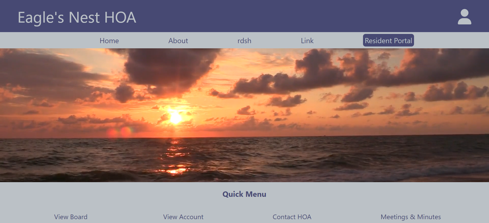
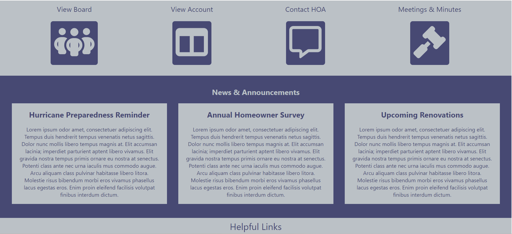
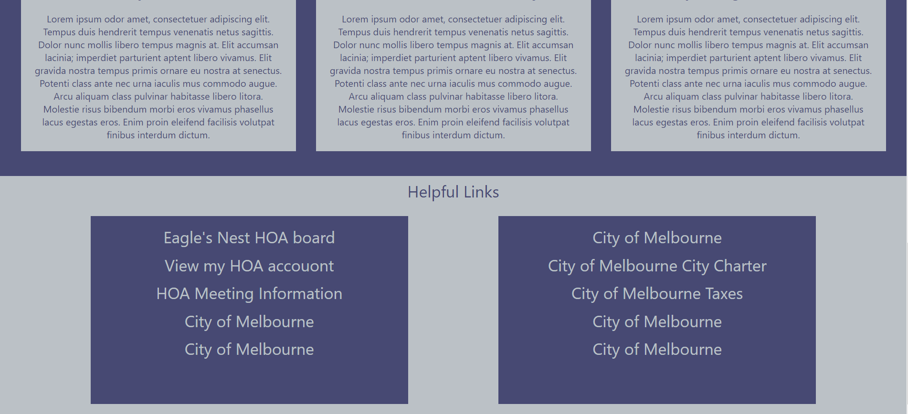
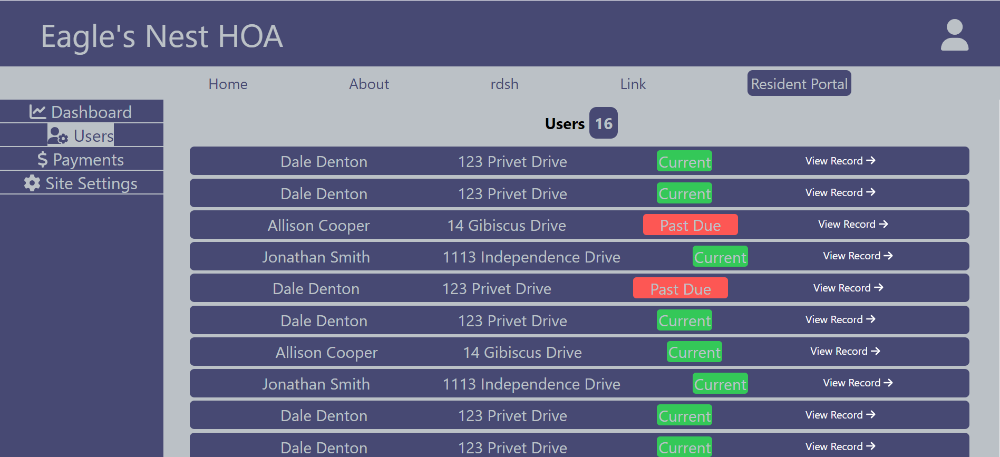
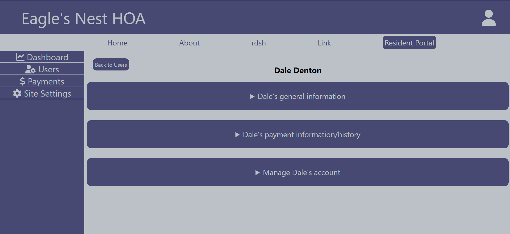
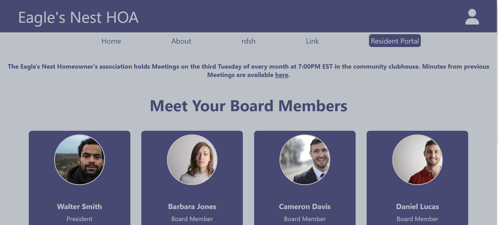
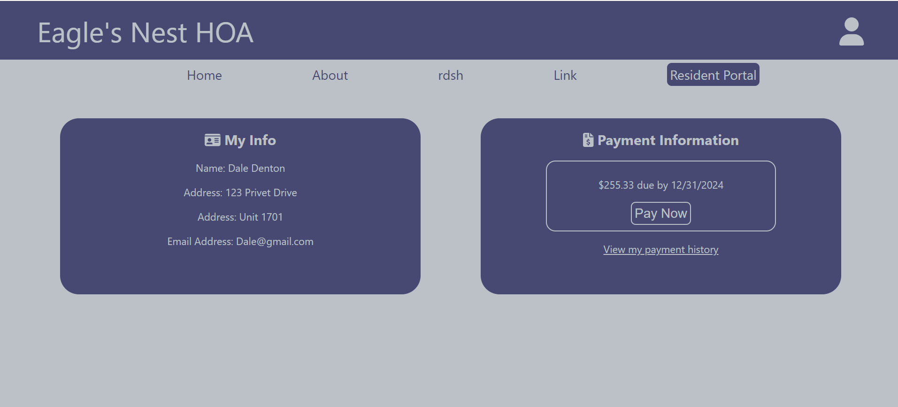

# Eagle's Nest HOA
#### An HOA management software solution 

Built in **React** via `create-react-app`

This project is currently under construction with an anticipated delivery date of *March 2025*. This application will satisfy the following acceptance criteria for the MVP:

1. A functional HOA management platform
2. A landing page with basic information about the association and the community
3. The ability for residents to login to individual accounts and view dues and a payment history
4. The ability for admin users to collectively manage tenant payments
5. The ability for admin users to publish blog posts seen on the homepage
6. The ability for admin users to manage resident's accounts (delete accounts, reset passwords, etc.)
7. The ability for residents to message HOA boardmembers

[this](https://michael-montgomery.github.io/eaglesnest/) is a link to the application in it's current state.

### Images of the application as of October 2024:

###### Homepage:

###### Admin View of Users:

###### Admin View of a Sungle User:

###### Board Members:

###### Resident Dashboard:

###### List of tools used:

HTML, CSS, Flexbox, Javascript, React...

## This application is the sole property of Michael Montgomery
